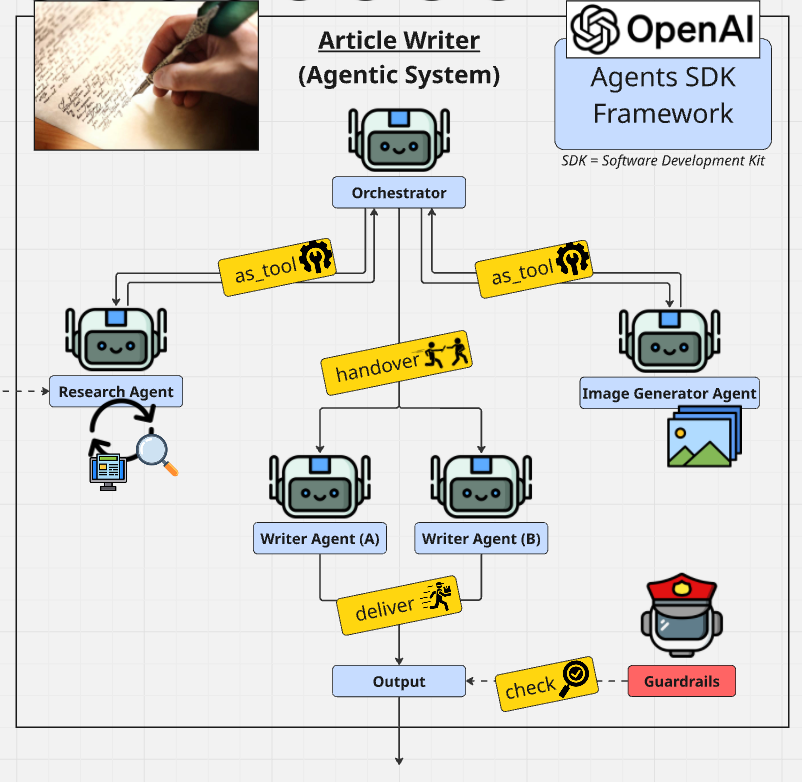

# AI Article Writer

A multi-agent article writing system built with the **OpenAI Agents SDK** and **Gradio**. Enter any topic and a coordinated pipeline of AI agents researches the web, generates an image, writes a polished article, and checks it through an editorial guardrail — all in one click.



---

## Examples

- [View Markdown Healthcare](outputs/article.md)
- [View Markdown Firefighting](outputs/article_20260415_152301.md)


## How It Works

The system uses six specialised agents coordinated by an orchestrator:

| Agent | Role | Model |
|---|---|---|
| **Orchestrator** | Coordinates all agents; chooses writer style | o4-mini |
| **Research Agent** | Searches the web and extracts content from sources | gpt-4.1-mini |
| **Image Generator** | Crafts a DALL-E prompt and generates the article image | gpt-4.1-mini + DALL-E 3 |
| **Writer A** | Writes in a formal, academic style | gpt-4.1-mini |
| **Writer B** | Writes in an engaging, conversational style | gpt-4.1-mini |
| **Guardrails Agent** | Reviews the article for safety, accuracy, and quality | gpt-4.1-mini |

**Pipeline flow:**
1. The orchestrator calls the Research Agent **twice** with slightly different queries and selects the richer brief.
2. The Image Generator Agent creates a relevant DALL-E 3 image.
3. The orchestrator hands off to Writer A (technical topics) or Writer B (general-interest topics).
4. The Guardrails Agent checks the article before it is returned. If it fails, the run is blocked.
5. The article (`.md`), image (`.png`), and combined page (`.html`) are saved to `outputs/` — all sharing the same timestamp.

---

## Features

- **Live web research** — DuckDuckGo search + full-page text extraction via trafilatura (minimum 6 sources)
- **AI image generation** — DALL-E 3 produces a 1024×1024 article image
- **Dual writing styles** — formal/academic or conversational, chosen automatically by the orchestrator
- **Editorial guardrail** — a dedicated agent checks safety, coherence, completeness, and quality
- **Timestamped exports** — `.png`, `.md`, and `.html` files share a timestamp so runs never overwrite each other
- **Gradio UI** — runs locally or deploys directly to Hugging Face Spaces

---

## Quickstart

### 1. Clone and install

```bash
git clone https://github.com/<your-username>/ai-article-writer.git
cd ai-article-writer
pip install -r requirements.txt
```

### 2. Set your API key

Create a `.env` file in the project root:

```
OPENAI_API_KEY=sk-...
```

### 3. Run

```bash
python app.py
```

Open `http://127.0.0.1:7860` in your browser, enter a topic, and click **Write Article**.

> ⏱️ Each run takes **2–4 minutes** — the research agent queries multiple web sources before writing begins.

---

## Outputs

Every run saves three files to the `outputs/` folder, all sharing the same timestamp:

```
outputs/
  article_*date_time*.png   ← DALL-E 3 image
  article_*date_time*.md    ← raw Markdown article
  article_*date_time*.html  ← styled HTML page with image embedded
```

The `.html` file references the `.png` by relative filename, so keep them in the same folder when sharing.

---

## Project Structure

```
ai-article-writer/
├── app.py                            # Gradio app — all agents, tools, and UI
├── requirements.txt
├── outputs/                          # Generated articles and images (git-ignored)
├── Article_Writer_Agentic_System.png # Architecture diagram
└── .env                              # API key (not committed)
```

---

## Deploying to Hugging Face Spaces

1. Create a new Space → **Gradio** SDK.
2. Push this repository to the Space.
3. Add `OPENAI_API_KEY` as a **Space Secret** (Settings → Variables and secrets).
4. The Space will install `requirements.txt` and launch `app.py` automatically.

---

## Requirements

| Package | Purpose |
|---|---|
| `openai-agents` | OpenAI Agents SDK — agent orchestration and tool use |
| `openai` | DALL-E 3 image generation |
| `gradio` | Web UI |
| `ddgs` | DuckDuckGo web search |
| `trafilatura` | Web page text extraction |
| `markdown` | Markdown-to-HTML conversion for exports |
| `requests` | Downloading generated images |
| `python-dotenv` | Loading `.env` for local development |
| `pydantic` | Structured guardrail output model |

---

## Configuration

| Variable | Where to set | Description |
|---|---|---|
| `OPENAI_API_KEY` | `.env` or HF Secret | Required — your OpenAI API key |
| `MODEL` | `app.py` line 22 | Base model for all agents (default: `gpt-4.1-mini`) |
| `EXAMPLE_TOPIC` | `app.py` line 23 | Pre-filled placeholder in the UI |

---

## License

MIT
