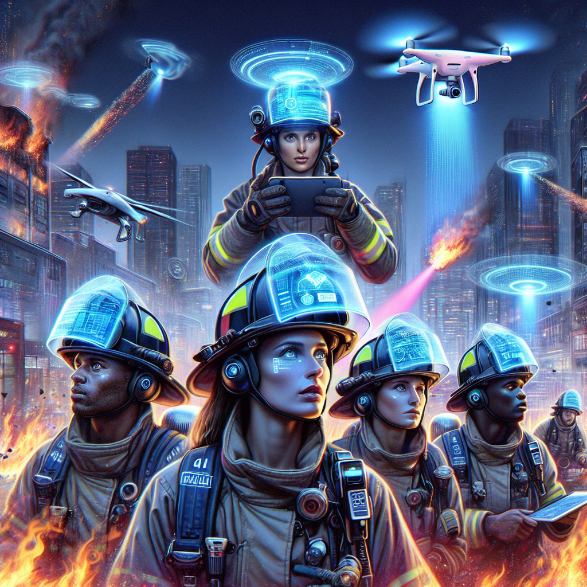

# The Role of Artificial Intelligence in Modern Firefighting

Artificial intelligence (AI) is increasingly transforming firefighting operations by enhancing detection, response, safety, and strategic management. By leveraging AI-powered tools and systems, fire services are able to reduce response times, improve firefighter safety, and optimize resource allocation in fire emergencies, ranging from urban structural fires to large-scale wildfires. This article explores the multifaceted applications of AI in firefighting, supported by data and current implementations.

## Executive Summary

AI integration in firefighting represents a paradigm shift that enables faster fire detection, smarter suppression strategies, and enhanced safety protocols. Key applications include early fire detection using machine learning and computer vision, predictive modeling for wildfire management, autonomous firefighting robotics, and AI-driven training and decision support systems. Challenges remain regarding data privacy and the need for human oversight, but AI's potential to revolutionize fire services worldwide is substantial.

## AI-Driven Fire Detection and Early Warning Systems

One of the most critical applications of AI in firefighting lies in the early detection and rapid notification of fire outbreaks. Traditional smoke and heat sensors are increasingly augmented or replaced by AI-powered systems that utilize video analytics, thermal imaging, and real-time environmental data. These systems discern true fire events from false alarms caused by dust, fog, or other disturbances, significantly improving accuracy and reducing response delays.

In wildfire-prone regions, networks of AI-enabled cameras and satellite CubeSats monitor vast areas to detect smoke and heat signatures. For instance, a network of 1,144 AI cameras deployed across California forests was able to identify wildfire symptoms within minutes, slashing detection time from several hours to minutes and enabling rapid suppression efforts. Similarly, AI-powered CubeSats can detect smoke plumes within 14 minutes of ignition, providing critical lead time to responders [1](https://www.firerescue1.com/artificial-intelligence/the-role-of-ai-in-modern-firefighting).

## Predictive Wildfire Management and Resource Optimization

Climate change and human activity are driving a projected 50% increase in wildfire frequency by 2100 globally. AI algorithms analyze comprehensive datasets—including weather patterns, topography, vegetation types, and fuel moisture—to generate predictive models of fire behavior and risk assessment. These models produce dynamic wildfire risk maps and simulate fire spread and intensity, which assist emergency managers in proactive resource deployment, containment planning, and evacuation strategies.

AI systems integrate heterogeneous data from drones, satellites, IoT environmental sensors, and social media to provide real-time situational awareness. Initiatives like the FireAId Project and the Wildfire Intelligence Fire Environment Resource (WIFIRE) system utilize AI-driven analytics to optimize firefighting tactics and coordinate global technology collaboration. AI also aids fire chiefs in resource allocation, ensuring that human and material assets respond efficiently to evolving emergencies [2](https://aiforgood.itu.int/robotics-and-ai-to-predict-and-fight-wildfires/), [3](https://www.zenadrone.com/wildfires/).

## Enhancing Firefighter Safety and Autonomous Response

AI enhances firefighter safety by powering wearable monitoring devices that track vital signs, exposure to noxious gases, and location in hazardous environments. Real-time alerts enable command centers to intervene promptly if a firefighter is endangered. Moreover, AI-driven autonomous robots and drones perform firefighting operations in environments too dangerous for humans, such as chemical plants or areas with extreme heat and smoke. For example, the Los Angeles Fire Department utilizes RS3 firefighting robots to contain fires remotely and reduce risk to personnel [4](https://aspiringfireofficers.com/using-ai-driven-fire-simulations-for-command-officer-training-advancements/).

Additionally, AI supports communication and coordination by analyzing emergency call data, optimizing dispatch routes with real-time traffic and fire location inputs, and integrating live video feeds. Firefighter training benefits from AI-powered virtual and augmented reality platforms that simulate high-risk scenarios in a safe, repeatable manner, offering better preparedness without exposure to real hazards [5](https://internationalfireandsafetyjournal.com/the-role-of-ai-in-modernfire-and-rescue-services/).

## Challenges and Ethical Considerations in AI Firefighting Integration

Despite promising advancements, AI adoption in firefighting encounters challenges. Data privacy concerns arise from collecting sensitive biometric and location information from firefighters. There is a critical need to maintain human oversight to prevent erroneous AI decisions that could compromise safety or operational integrity. Transparency in AI algorithms and ethical guidelines for emergency response technology remain priorities as systems scale globally.

Moreover, the costs involved in deploying high-tech AI infrastructure and training personnel may be prohibitive for some departments, particularly in developing regions. Effective collaboration between AI developers, fire agencies, and regulatory bodies is essential to realize AI’s full potential in fire services while addressing legal, ethical, and operational constraints.

## Conclusion

The integration of artificial intelligence into firefighting is driving significant improvements across detection, prediction, operational safety, and training. AI-powered fire detection systems reduce identification time from hours to minutes, enabling faster containment and damage reduction. Predictive wildfire models support proactive resource allocation and risk mitigation amid increasing fire frequency. Autonomous firefighting robotics and AI-enhanced communication ensure firefighter safety and operational efficiency. Although challenges remain in ethics, privacy, and cost, the data clearly demonstrate that AI is becoming indispensable to modern firefighting efforts globally.

### Key Takeaways
- AI reduces fire detection time and false alarms through multi-sensor data fusion and machine learning.
- Predictive wildfire management using AI improves resource deployment and evacuation planning.
- AI-supported wearable tech and autonomous robots enhance firefighter safety in hazardous conditions.
- AI-driven VR training platforms amplify preparedness through realistic, risk-free simulations.
- Ethical, privacy, and cost considerations must be balanced to fully realize AI’s benefits in firefighting.

---

## References

1. The Role of AI in Modern Firefighting, FireRescue1  
https://www.firerescue1.com/artificial-intelligence/the-role-of-ai-in-modern-firefighting  
2. Robotics and AI to Predict and Fight Wildfires, AI For Good Global Summit  
https://aiforgood.itu.int/robotics-and-ai-to-predict-and-fight-wildfires/  
3. Wildfires: AI Uses in Predicting and Fighting Wildfires, ZenaDrone  
https://www.zenadrone.com/wildfires/  
4. Using AI-Driven Fire Simulations for Command Officer Training Advancements, Aspiring Fire Officers  
https://aspiringfireofficers.com/using-ai-driven-fire-simulations-for-command-officer-training-advancements/  
5. The Role of AI in Modern Fire and Rescue Services, International Fire and Safety Journal  
https://internationalfireandsafetyjournal.com/the-role-of-ai-in-modernfire-and-rescue-services/
